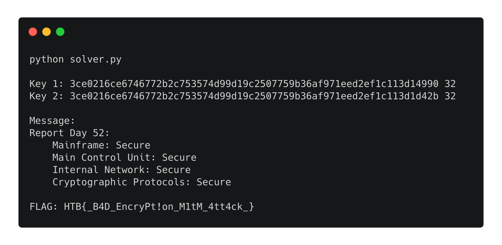

# [__Spy__](#[Spy])

### Description:
* Darn it, we cant crack the enemy's morning report! They found out that their cryptographic protocols are compromised, and doubled the encryption. Can you crack their new encryption scheme?

### Objective:
* Identify that the key generation process uses a static initialization seed value and only randomizes the 16 LSB, which can lead to a Meet In The Middle attack to recover the AES keys provided a message in plaintext and encrypted format.

### Flag
* `HTB{_B4D_EncryPt!on_M1tM_4tt4ck_}`

### Difficulty:
* `easy` 

### Release:
* [/release/crypto_spy.zip](release/crypto_spy.zip) (`75822d44f7323881c6109f93b7ec5912f7e7c8ed4b00e3bb94c9f627edce7bf3`)

### Challenge: 

# [__Examining the provided files__]()

The challenge is providing us with 4 files, one of them being the source code used for the encryption of the flag.

```
 challenge.py (The encryption algorithm script)

 flag.txt.enc (The encrypted flag)

 cracked_packets.txt (A series of messages - unencrypted)

packet_6.txt.enc (The encrypted message)
```

By observing the challenge.py we can see that the encryption process includes a double AES encryption with the keys created by the keygen() function.

Moving on we can see that the keys used by the AES are generated with the `keygen()`,  so we will analyze the code of this function.

```python
BIT_SIZE = 256
BYTE_SIZE = 32

def keygen():
    random.seed(BYTE_SIZE)
    h = random.getrandbits(BIT_SIZE)
    for i in range(BIT_SIZE):
        random.seed(time.time())
        h = h ^ random.getrandbits(2*BIT_SIZE/BYTE_SIZE)
    return hex(h)[2:-1]
```


-  The first seed is the `static value BYTE_SIZE=32`. Because the keygen() is called twice to generate the two different AES keys and each time the random function is initialized again the value of `h`  is the same.

- The XOR operation the seed value this time is randomized properly but the `random.getrandbits(2*BIT_SIZE/BYTE_SIZE)` return only  16bits, hence only the 16 LSB of the `h` are randomized.

 Based on the above observations we can conclude that the function  generates an almost predictable key,  where only the last 16 bits are randomized.

# [__Identifying and exploiting the vulneravility__]()

The above misconfiguration leaves the encryption scheme susceptible to a Meet In The Middle attack, but in order to leverage this vulnerability we first need to identify the plaintext of the second encrypted file provided to us.

Observing the unencrypted messages on the cracked_packets.txt we can derive the needed plaintext from the packet-6:

```
Report Day 52:
    Mainframe: Secure
    Main Control Unit: Secure
    Internal Network: Secure
    Cryptographic Protocols: Secure

```

If we bruteforce the last 16 bits of the key used in the first AES block (let's say key1) by encrypting packet_6.txt we expect that the output will match with the one coming from the AES decryption of packet_6.txt.enc only if both the second key (let's say key2) and key1 are the correct ones. 

So we build a dictionary like encrypted[resulting_ciphertext] = key1 and we try to find a match with the following property: `encrypted[resulting_ciphertext] = key2`.

Once we have a match, we have the valid key1 and key2 so that we can proceed with the decryption of the flag.


### Solver:

By automating the bruteforcing process with the following python script we can obtain the flag.

```python
from Crypto.Cipher import AES
import random
import time

BIT_SIZE = 256
BYTE_SIZE = 32

def pad(payload, block_size=BYTE_SIZE):
    length = block_size - (len(payload) % block_size)
    return payload + chr(length) * length

def solve(plaintext, ciphertext, keygen):
    encrypted = {}
    for key in keygen():
        cipher = AES.new(key, mode=AES.MODE_ECB)
        encrypted[cipher.encrypt(pad(plaintext))] = key
    for key in keygen():
        cipher = AES.new(key, mode=AES.MODE_ECB)
        decrypted = cipher.decrypt(ciphertext)
        if(decrypted in encrypted):
            key1 = encrypted[decrypted]
            key2 = key
            return (key1,key2)

def func_keygen():
    baseString = keygen().decode('hex')[:-2]
    for a in range(256):
        s1 = baseString + chr(a)
        for b in range(256):
            yield s1 + chr(b)

def keygen():
    random.seed(BYTE_SIZE)
    h = random.getrandbits(BIT_SIZE)
    for i in range(BIT_SIZE):
        random.seed(time.time())
        h = h ^ random.getrandbits(2*BIT_SIZE/BYTE_SIZE)
    return hex(h)[2:-1]

def decrypt(ct, key1, key2):
    cipher = AES.new(key2, mode=AES.MODE_ECB)
    pt1 = cipher.decrypt(ct)
    cipher = AES.new(key1, mode=AES.MODE_ECB)
    pt2 = cipher.decrypt(pt1)
    return pt2

if __name__ == "__main__":
    import base64
    message = open('packet_6.txt').read()
    ct_message = base64.b64decode(open('../release/packet_6.txt.enc').read())
    ct_flag = base64.b64decode(open('../release/flag.txt.enc').read())
    (key1,key2) =  solve(message, ct_message, func_keygen)
    print 'Key 1:', key1.encode('hex'), len(key1)
    print 'Key 2:', key2.encode('hex'), len(key2)
    print "\nMessage:\n", decrypt(ct_message, key1, key2)
    print "FLAG:", decrypt(ct_flag, key1, key2)
```





