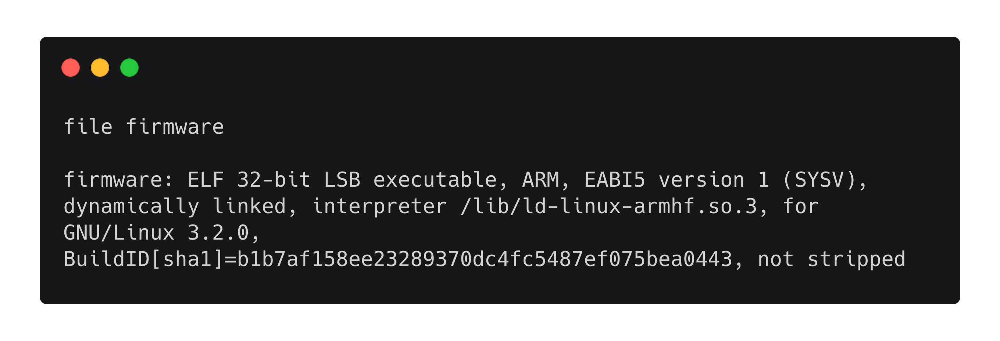
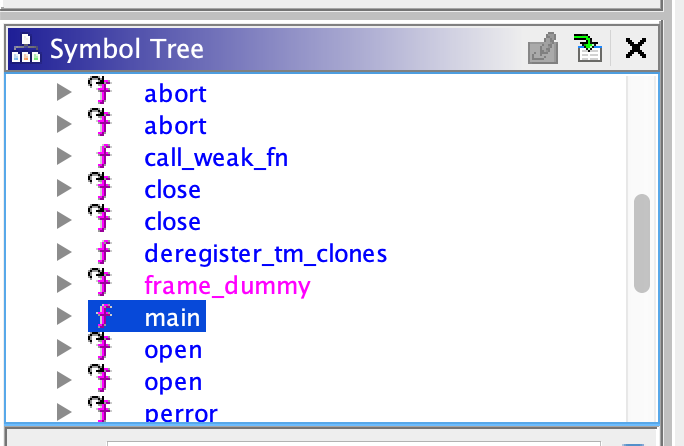
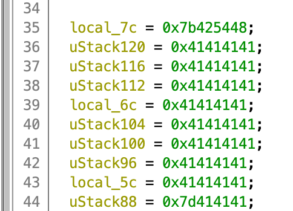
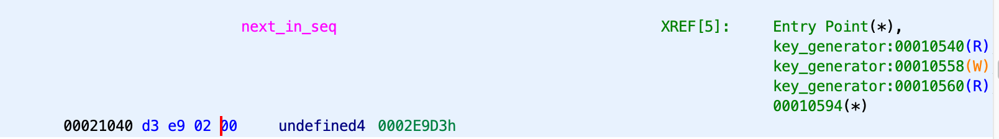
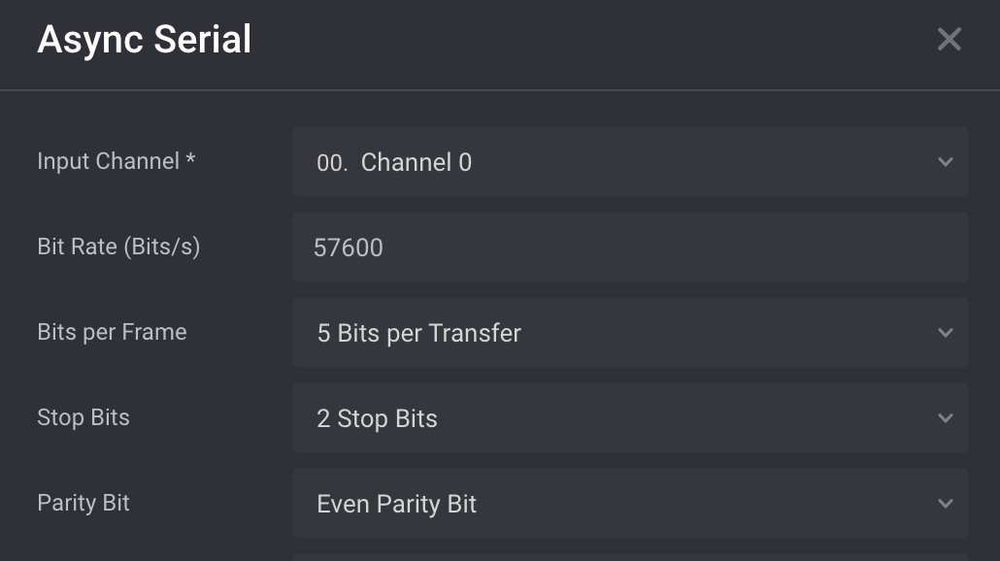
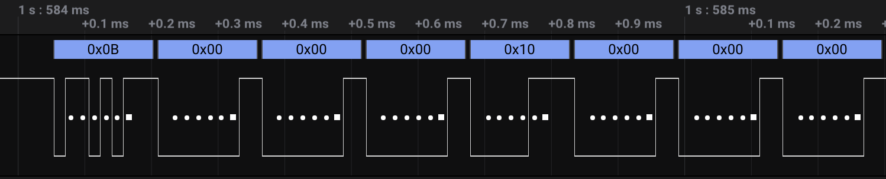

# [__Undercover__](#Undercover)

### Description:

* A mysterious device is transmitting secret messages over our serial network, but we cannot decode the message. Luckily we found a similar device and extracted its firmware, but the secret we are trying to retrieve wasn't stored in it. Can you analyze the binary and recover the message that we captured on our network?

### Objective:
* Reverse engineer the provided binary in order to understand how the data was transmitted over the serial channel, and decode them in order to decrypt the secret transmitted over it.

### Difficulty:
* `Hard`

### Flag:
* `HTB{10w_13v31_f12mw423_23v3251n9_141152}`

### Challenge:

The challenge provides us with two files:

* **.sal**: Logic data captured by an embedded device
* **binary file**: The firmware of the device

We will start our analysis from the binary in order to see how the device operates and what serial protocol it uses. We can find the architecture in which the firmware was compiled by issuing the file command.



It appears that the binary file is an ELF executable compiled in `ARM` and that it is not stripped. Thus we can use Ghidra in order to decompile the code for further analysis. Once we import the firmware and perform the automated analysis the tool provides, we can navigate to main().



With a simple static analysis, we can deduce that the binary:

* Contains hardcoded data
* Opens a serial connection
* Performs some bitwise operations
* Changes the configuration of the connections file descriptor.
* Contains a key_generator

In order to fully understand the functionality of it, we must perform an in-depth analysis of each of the above.

##### Hardcoded data

The hardcoded data contained in the binary are used for variables and contain the following information:

 

The binary is compiled for a little-endian system (LSB), thus we must parse the data in the reverse order.

```python

string_a = [0x7b425448,
			0x41414141,
			0x41414141,
			0x41414141,
			0x41414141,
			0x41414141,
			0x41414141,
			0x41414141,
			0x41414141,
			0x7d414141]

string_a_ascii = ""
for i in range(0,len(string_a)):
	for j in range(0,4):
		string_a_ascii += chr(string_a[i] >> 8*j & 0x000000FF)

print string_a_ascii
print string_b_ascii
'''
HTB{AAAAAAAAAAAAAAAAAAAAAAAAAAAAAAAAAAA}
'''
```

It appears that the  string is an empty flag value, which indicates where the flag (or message) is in our target device.

##### Xor 

The decompiled code shows Xor operation being performed with the hardcoded strings contained in the variables `bVar2` and ` bVar1`.

```C
while (local_14 < 0x28) {
  bVar1 = *(byte *)((int)&local_84 + local_14);
  bVar2 = key_generator();
  abStack172[local_14] = bVar2 ^ bVar1;
  local_14 = local_14 + 1;
}
```

##### key_generator

Each character of the message is XORed with a character generated by key_generator(). This function appears to be a Linear Congruential Generator that generates pseudorandom numbers in the range of ``0x00 to 0xFF``.

```C

uint key_generator(void)

{
  next_in_seq = next_in_seq * 0x303577d + 0x145a;
  return next_in_seq % 0xff;
}
```

The variable next_in_seq acts as the seed and pseudo randomly generated value at each call. It's a global variable that is initialized outside main.



Thus the next_in_seq is equal to `0xd3e90200` LSB or `0x2e9d3 == 190931` MSB. Moreover, next_in_seq is an unsigned int which means that the maximum value of the variable is `4294967295 (0xffffffff)`. In order to generate valid numbers in a language like Python, we would make to mask or set a limit with a modulo of `% 0xffffffff` in order to stay inside the 32-bit space the uint variable is set in C.

##### Open connection

Moving on we can see that a connection is opened on the device, given by the function parameter 2 and the file descriptor passes on the local_14 variable, which is then accessed by tcgetattr().

```c
  if (param_1 == 1) {
    uVar2 = 0xffffffff;
  }
  else {
    printf("[!] sending data to %s\n",*(undefined4 *)(param_2 + 4));
    local_14 = open(*(char **)(param_2 + 4),0x902);
    if (local_14 == -1) {
      perror(*(char **)(param_2 + 4));
      uVar2 = 0xffffffff;
    }
    else {
      iVar1 = tcgetattr(local_14,&local_54);
      if (iVar1 < 0) {
        perror("[x] configuration error");
        uVar2 = 0xffffffff;
      }
      else {
        local_54.c_iflag = 0;
        local_54.c_oflag = 0;
        local_54.c_lflag = 0;
        local_54.c_cc[6] = '\0';
        local_54.c_cc[5] = '\0';
        local_54.c_cflag = 0x1141;
        tcsetattr(local_14,0,&local_54);
```

The line with significant interest is `local_54.c_cflag = 0x1141;` since it's the only line that adjusts the configuration. This can yield valuable information on how to decode the logic data we have from the challenge. We can see that this type of configuration is used by termios, which is a common library for serial communication protocols. Based on the source code of [termios.h](https://code.woboq.org/qt5/include/bits/termios.h.html), we can find the necessary information to decode the above register into meaningful data.

```
local_54.c_cflag = 0x1141 == 4417 (dec) == 0b1000101000001
```

By analyzing the available configuration options for the above flag (look for: ` c_cflag bit meaning` on the source code) we can find the corresponding values to the above value.

``` ==
#define   CS5	     0000000 == 0b000000
#define   B57600   0010001 == 0b1000000000001
#define   PARENB	 0000400 == 0b100000000
#define   CSTOPB	 0000100 == 0b1000000

0000000 | 0010001 | 0000400 | 0000100 = 0b1000101000001 == 4417 (dec) == 0x1141
```

From the above we conclude that:

* The baud rate is 57600 
* The bits per transfer are 5
* It uses even parity bits
* It uses two stop bits

##### Bitwise operations

Moving forward, we observe a few more bitwise operations, which are essentially splitting each byte into its `HI` and `LO` bits and adding one.

```c
    local_10 = 0;
    local_c = 0;
    while (local_c < 0x28) {
      aiStack444[local_10] = (uint)(*(byte *)((int)&local_7c + local_c) >> 4) + 1;
      aiStack444[local_10 + 1] = ((uint)*(byte *)((int)&local_7c + local_c) & 0xf) + 1;
      local_10 = local_10 + 2;
      local_c = local_c + 1;
    }
```
The new array generated here `aiStack444` is the one that is written in the serial channel `local_18 = write(local_14,aiStack444,0x140);`.

Now that we have obtained all the necessary information form the binary we can decode the logic data by opening the .sal file with [Logic](https://www.saleae.com/downloads2/). We can also use the built-in analyzer to decode the signal and export the data into a .csv



 

After we add the analyzer we can see the transmitted data:



It appears that some null bytes are transmitted, but that's not part of the encrypted data since we saw in the binary and one is added at the end of each shift operation. Thus a `0x01` is the minimum value we should expect to see. The above assumption can also be verified by the fact that the transmitted data is 4 times larger than the generated string.

```c
int aiStack524 [80];
write(local_14,aiStack524,0x140); //0x140 == 320 (dec)
```

Finally, with all the pieces of the puzzle known we can craft our final script to automate the decryption of the serial data.

## Solver

```python
file = open('flag_encrypted.csv')
data = file.readlines()
file.close()

cc = 0
flag = ""
char_part = ""

next_in_seq = 190931

def key_generator():
	global next_in_seq
	next_in_seq = (next_in_seq * 12935452541 + 5210) % 2**32
	return ((next_in_seq) % 0xff)

xor_key = ""

for i in range(1,len(data)):	
	data_lines = data[i].split(",")[1:]
	for elem in data_lines:
		if elem.strip() != "0x00":
		
			if cc != 0 and cc%2 == 0:

				decrypted_char =  chr(int(char_part,16) ^ key_generator())
				flag += decrypted_char
				
				char_part = ""

			hex_hl = (int(elem.strip(),16) -1)
			hex_hl = hex(hex_hl)[2:]
			char_part += hex_hl
			cc += 1

flag += chr(int(char_part,16) ^ key_generator())

print "Flag:",flag

'''
Output:
Flag: HTB{10w_13v31_f12mw423_23v3251n9_141152}
'''
```

