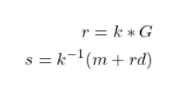

# [__suspicious signing__](#suspicious_signing)

### Description:
* Our agents have gained access to a signing server that the enemy spies used to sign their messages. I wonder if you can use it to decrypt the secret information?

### Objective:
* reused nonce attack owing to deterministic nonces based on MD5 hashes, which is vulnerable to collisions

### Difficulty:
* `Medium`

### Flag:
* `HTB{r3u53d_n0nc35?n4h-w3_g0t_d3t3rm1n15t1c-n0nc3s!}`

### Release:
* [/release/crypto_suspicious_signing.zip](release/crypto_suspicious_signing.zip) (`34165150f70cf47ac43d09d6de5bdc8a60b7a7c11d6c0a137d0f835055bd4f49`)

### Challenge:

```python
from hashlib import md5
from Crypto.Util.number import bytes_to_long, long_to_bytes
from Crypto.Cipher import AES
from Crypto.Util.Padding import pad
from ecdsa import ellipticcurve
from ecdsa.ecdsa import curve_256, generator_256, Public_key, Private_key
from random import randint
from os import urandom

flag = open("flag.txt").read().strip().encode()
G = generator_256
order = G.order()

def genKey():
    d = randint(1,order-1)
    pubkey = Public_key(G, d*G)
    privkey = Private_key(pubkey, d)
    return pubkey, privkey
    
def ecdsa_sign(msg, privkey):
    hsh = md5(msg).digest()
    nonce = md5(hsh + long_to_bytes(privkey.secret_multiplier)).digest() * 2
    sig = privkey.sign(bytes_to_long(msg), bytes_to_long(nonce))
    return msg, sig.r, sig.s

def encryptFlag(privkey, flag):
    key = md5(long_to_bytes(privkey.secret_multiplier)).digest()
    iv = urandom(16)
    cipher = AES.new(key, AES.MODE_CBC, iv)
    ciphertext = cipher.encrypt(pad(flag, 16))
    return ciphertext, iv
    
pubkey, privkey = genKey()
ct, iv = encryptFlag(privkey, flag)
print(f"""Encrypted flag: {ct.hex()}
iv: {iv.hex()}""")
while True:
    msg = input("Enter your message in hex: ")
    try:
        msg = bytes.fromhex(msg)
        m, r, s = ecdsa_sign(msg, privkey)
        print(f"""Message: {m.hex()}
r: {hex(r)}
s: {hex(s)}""")
    except:
      print("An error occured when trying to sign your message.")
```

We get access to a server that implements the ECDSA signing algorithm. The flag is encrypted using AES using the MD5 of the private ECDSA key as the key. We can provide input to the server to sign any message of our choosing, and we need to figure out how to recover the private key. Let's review how ECDSA signing works.

Firstly, to do anything with ECDSA, we need to have a keypair. We first take a generator on our elliptic curve. This is known as the generator point, abbreviated to `G`. We then generate a random integer between 1 and the curve's order. This is known as the private integer `d`. Finally, we multiply our generator point by the private integer to get our public point. Our public key consists of the generator point and public point, and our private key consists of the private integer. Now we can look in more depth at ECDSA.

When we sign using ECDSA, this returns a signature that consists of two parts, often referred to as the `r` part and the `s` part. The `r` part is generated by multiplying our generator point `G` by a random integer between 1 and the order of the point. This number is often referred to as the `nonce`, as it should only be used once. We multiply our generator point and our nonce together, and then we take the x coordinate of this point to get our `r` value. The `s` part is generated by taking the inverse of our nonce mod order, then multiplying that by the hash of the message plus the `r` value multiplied by the private integer `d`.

In equation form, that looks like:  

<p align='center'>
  
<p align='center'>


How can we attack this? Well, some of the most common and simple attacks rely on poor nonce generation. It's important to make sure that the nonce is always kept secret. When the secret nonce is known, we can recover the private key.

Looking back at the equation to generate ECDSA signatures, notice that if we know the nonce `k`, then everything is known.

```
r = k * G
s = k^-1 (m + rd)
```

We know `k`, `m` and `r`, so it is trivial to work out `d`. 

```
s = k^-1(m + rd)
sk = m + rd
k = (m + rd) * s^-1
```

An implementation of this is below.

```python
k = 
m = 
r = 
s = 
order = 
d = (s*k - m) * pow(r, -1, order)
```

There is also a well-known attack on reused nonces. Even if the nonce is always kept secret from the user, if a nonce is reused, the entire ECDSA scheme can be broken. A reused nonce is also very easy to identify, as the `r` values will be the same.

Let `k` be our reused nonce, let `m1` and `m2` be our two messages, let `r` be our same r value, and let `s1` and `s2` be the two s parts of the signatures.

We have the following equations:

```
s1 = k^-1(m1 + dr)
s2 = k^-1(m2 + dr)
```

We can subtract s2 from s1 to get:

```
s1 - s2 = k^-1(m1 + dr) - k^(m2 + dr)
```

Simplifying and rearranging:

```
s1 - s2 = k^-1(m1 - m2 + dr - dr)
s1 - s2 = k^-1(m1 - m2)
k * (s1 - s2) = (m1 - m2)
k = (s1 - s2)^-1 * (m1 - m2)
```

And since we know all of the values on the right side, we can easily work out `k`. We can then use our attack from above to recover the private key `d`. An implementation of this is below.

```python
m1 = 
m2 = 
s1 = 
s2 = 
r = # we only need one since they will be the same
order = 
k = (pow(s1-s2,-1,order) * (m1-m2)) % order
print(f'k: {k}')
d = (((s1 * k) - m1) * pow(r,-1,order) % order)
print(f'private key: {d}')
```

## Deterministic nonces?

Looking closer at how the server generates nonces, we see this:

```python
def ecdsa_sign(msg, privkey):
    hsh = md5(msg).digest()
    nonce = md5(hsh + long_to_bytes(privkey.secret_multiplier)).digest() * 2
    sig = privkey.sign(bytes_to_long(msg), bytes_to_long(nonce))
```

Notice how the hash is generated by the hash of the message we want to sign? This means that the nonce is deterministic. While we don't know the exact value of the nonce, since the nonce is the hash of the hash of the message plus the private key, we notice that it uses the MD5 hashing algorithm, which is well known for having collisions. This means that we can have two distinct messages with the same hash, but different content. This should result in two signatures that have the same generated nonce.

We also notice that it uses the number representation of the message instead of the hash of the message. This means that if we can make 2 messages that have the same hash and different content, their nonces will be the same, but their `s` values will not be the same, because of their different content. If the server used the hash of the message, specifically the MD5 hash, this attack would not work, because it would result in the exact same signature.

There are many known ways to generate MD5 collisions nowadays, a lot of them are on [here](https://github.com/corkami/collisions). However, we can just pick two known hex strings with the same MD5 hash. For my solve script I have used the two strings (in hex):

```
string1 = "d131dd02c5e6eec4693d9a0698aff95c2fcab58712467eab4004583eb8fb7f8955ad340609f4b30283e488832571415a085125e8f7cdc99fd91dbdf280373c5bd8823e3156348f5bae6dacd436c919c6dd53e2b487da03fd02396306d248cda0e99f33420f577ee8ce54b67080a80d1ec69821bcb6a8839396f9652b6ff72a70"
string2 = "d131dd02c5e6eec4693d9a0698aff95c2fcab50712467eab4004583eb8fb7f8955ad340609f4b30283e4888325f1415a085125e8f7cdc99fd91dbd7280373c5bd8823e3156348f5bae6dacd436c919c6dd53e23487da03fd02396306d248cda0e99f33420f577ee8ce54b67080280d1ec69821bcb6a8839396f965ab6ff72a70"
```

Sending these two to the server to get our `r`, `s1` and `s2` values, and also making sure that the `r` value is the same for both signatures, we can then work out the private key using our attack above and decrypt the flag!

### Solver:

```python
from pwn import *
from hashlib import md5
from Crypto.Util.number import bytes_to_long, long_to_bytes
from Crypto.Cipher import AES
from Crypto.Util.Padding import unpad

s = remote("localhost",1337)
encflag = bytes.fromhex(s.recvline().decode().split(" ")[-1])
iv = bytes.fromhex(s.recvline().decode().split(" ")[-1])

hash1 = "d131dd02c5e6eec4693d9a0698aff95c2fcab58712467eab4004583eb8fb7f8955ad340609f4b30283e488832571415a085125e8f7cdc99fd91dbdf280373c5bd8823e3156348f5bae6dacd436c919c6dd53e2b487da03fd02396306d248cda0e99f33420f577ee8ce54b67080a80d1ec69821bcb6a8839396f9652b6ff72a70"
hash2 = "d131dd02c5e6eec4693d9a0698aff95c2fcab50712467eab4004583eb8fb7f8955ad340609f4b30283e4888325f1415a085125e8f7cdc99fd91dbd7280373c5bd8823e3156348f5bae6dacd436c919c6dd53e23487da03fd02396306d248cda0e99f33420f577ee8ce54b67080280d1ec69821bcb6a8839396f965ab6ff72a70"

s.recvuntil("hex:")
s.sendline(hash1)
s.recvline() # message
r = int(s.recvline().decode().split(" ")[1], 16)
s1 = int(s.recvline().decode().split(" ")[1], 16)
s.recvuntil("hex:")
s.sendline(hash2)
s.recvline() # message
s.recvline() # r is the same since reused nonce
s2 = int(s.recvline().decode().split(" ")[1], 16)
print(f'r: {r}')
print(f's1: {s1}')
print(f's2: {s2}')

order = 115792089210356248762697446949407573529996955224135760342422259061068512044369 # just use the imports to get this
m1 = int(hash1,16)
m2 = int(hash2,16)

k = (pow(s1-s2,-1,order) * (m1-m2)) % order
print(f'k: {k}')
d = (((s1 * k) - m1) * pow(r,-1,order) % order)
print(f'private key: {d}')

key = md5(long_to_bytes(d)).digest()
cipher = AES.new(key, AES.MODE_CBC, iv)
plaintext = unpad(cipher.decrypt(encflag), 16)
print(f'Flag: {plaintext.decode()}')
```
