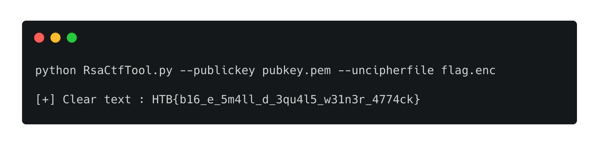
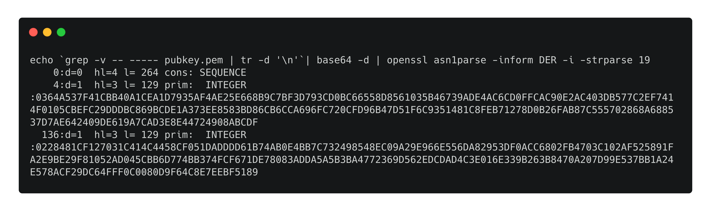
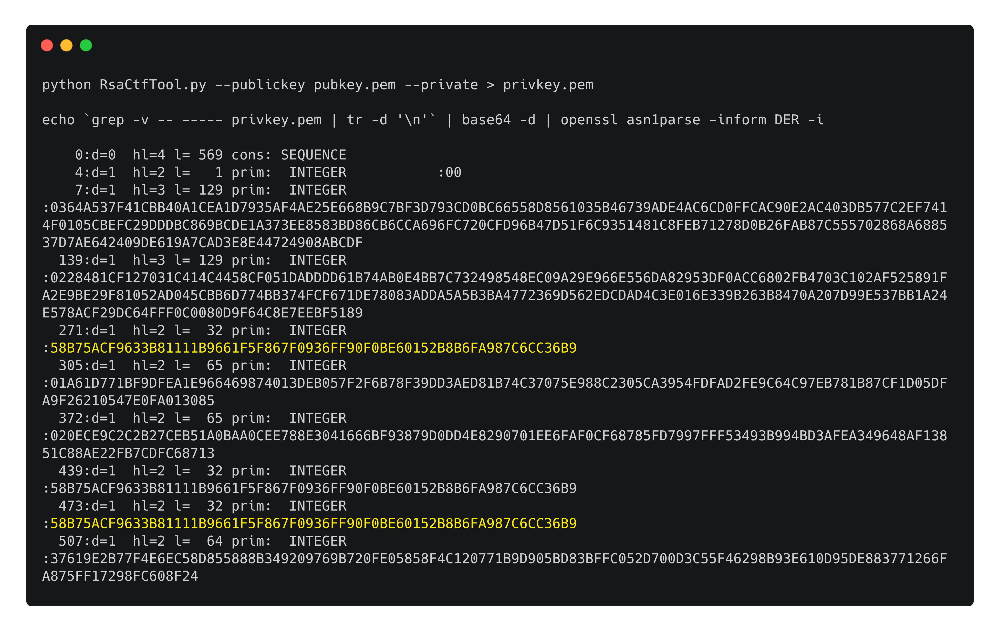

# [__Weak RSA__](#weak-rsa)

### Description:
* A potential operative stole a file from one of the air-gapped computers and encrypted it with RSA before he got apprehended. We have only managed to recover the public key. Can you help us decrypt this ciphertext?

### Objective:
* Uncypher the encrypted flag by recovering the private key from the weak Public key using RsaCtfTool.py

### Difficulty:
* `very easy`

### Flag:
* `HTB{b16_e_5m4ll_d_3qu4l5_w31n3r_4774ck}`

### Release:
* [/release/crypto_weak_rsa.zip](release/crypto_weak_rsa.zip) (`2aa885dfce2e8f5c163517f3a03e69b25ba6d6e3b3fc03a9b5d870de26bc9477`)

### Challenge:
The provided `pubkey.pem` indicates that the algorithm used to encrypt the flag is RSA. By using RsaCtfTool to analyze the data, we can obtain the flag

#### The Vulnerability 
If we further analyze the public key we can see that the exponent used is the same length as the modulus. Hence the private key (d) is probably small in length, making the key pair vulnerable to the Weiner Attack.

Indeed if we export the recovered private key with RsaCtfTool and analyze it, we can see that it's significantly smaller than the Modulus (n) and the Exponent (e).

