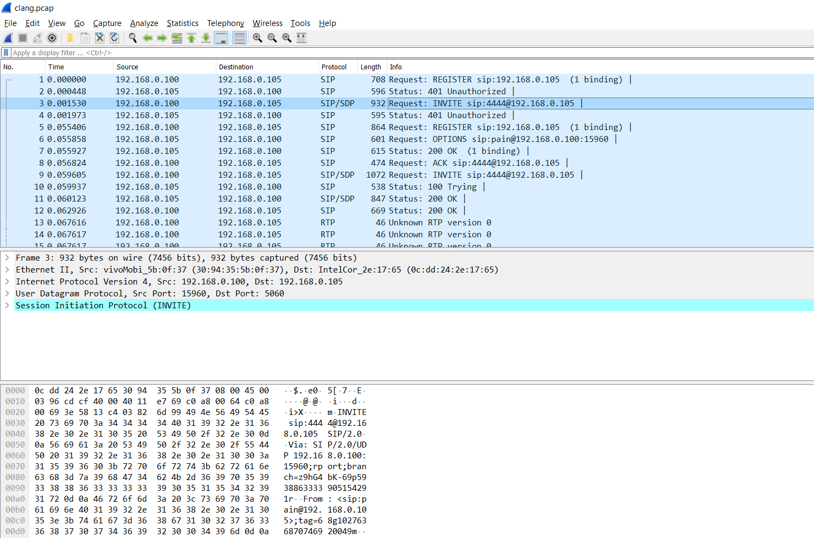
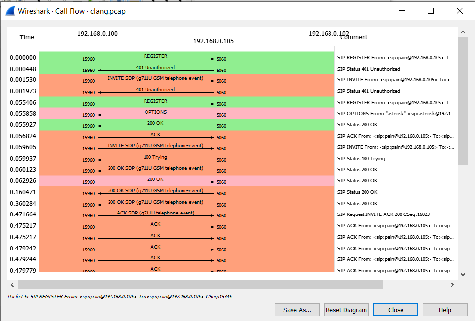
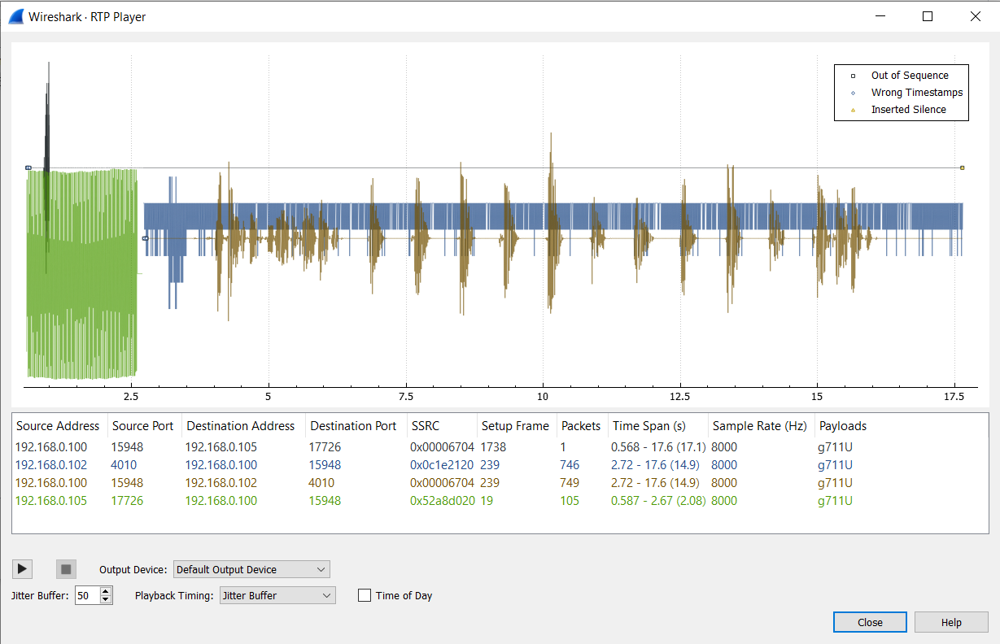
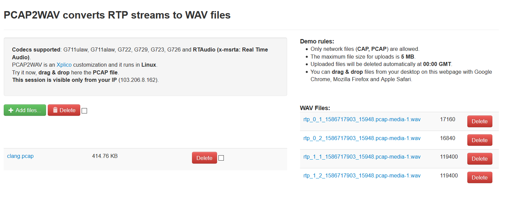
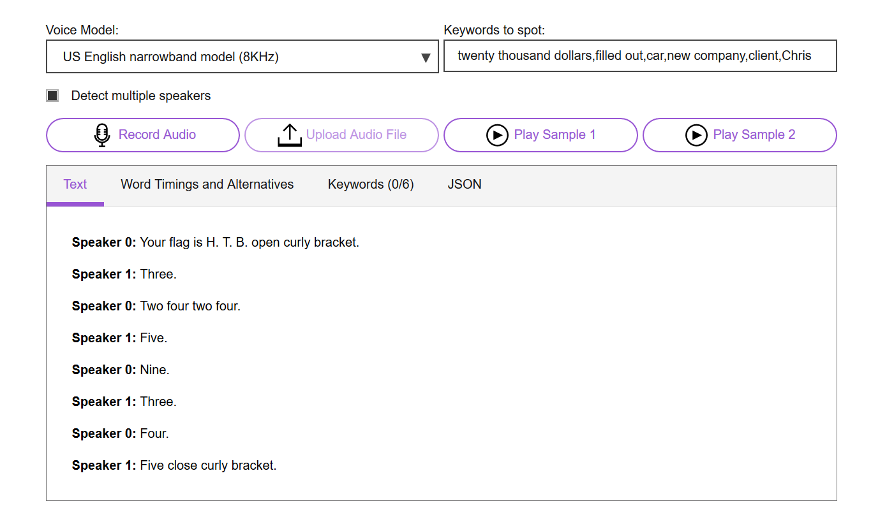

# [__Clang__](#clang)

### Description:
* We have intercepted an unknown communication from within the target network, could you help us decode it?

### Objective:
* Convert extracted RTP stream to `.wav` and TTS.

### Difficulty:
* `very easy`

### Flag:
* `HTB{3242459345}`

### Release:
* [/release/forensics_clang.zip](release/forensics_clang.zip) (`0d83bde688be4c062022e50aee9295d69a55c22fde53a149f4327d66cdb9c2b0`)

### Challenge:

This looks like a VoIP packet. We're going to filter the `SIP` flow sequence, and on the Wireshark menu we go to `Telephony -> SIP Flows -> flow sequence`.

We can see that user `SIP\pain` conducted a call. We can now check the `RTP` stream, on the Wireshark menu we go to `Telephony -> VoIP Calls -> Play Steams`.

We first extract the audio from the `.pcap` file and then convert it to a music file using this script [pcap2wav](https://gist.githubusercontent.com/avimar/d2e9d05e082ce273962d742eb9acac16/raw/a7722d6dbe435f0c694bbcc87c2c2c3ccc04f818/pcap2wav). We could also use this website: [pcap2wav.xplico.org](http://pcap2wav.xplico.org/).

We're going to download the 3rd stream and upload it to a [speech to text](https://speech-to-text-demo.ng.bluemix.net/) website.

The person speaking says: `Your flag is HTB{3242459345}`
