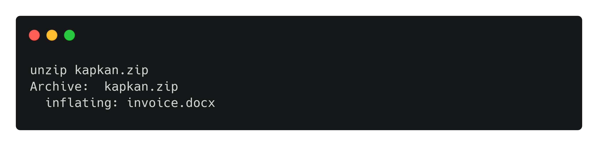
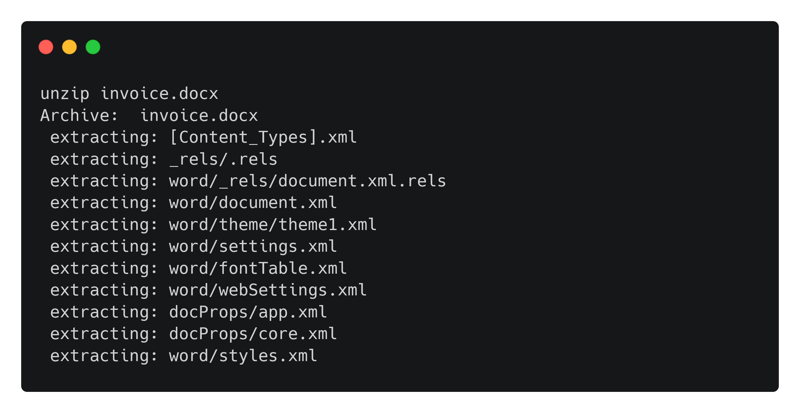
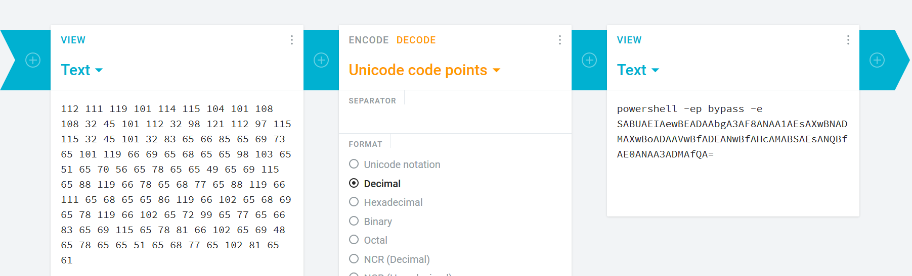
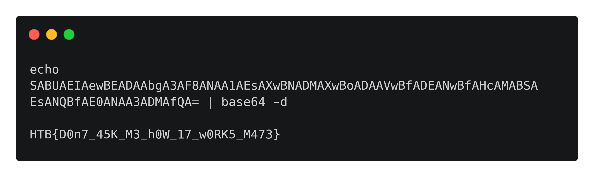

# [__kapKan__](#)

### Description:
* We received an email from one of our operatives that contains an attachment. However, after calling the operative, it seems they have no knowledge of this. We strongly believe that this document contains something malicious from "the firm". Can you take a look?

### Objective:
* Extract inserted DDE data from the document.

### Difficulty:
* `very easy`

### Flag:
* `HTB{D0n7_45K_M3_h0W_17_w0RK5_M473}`

### Release:
* [release/kapkan.zip](release/kapkan.zip)

### Challenge:

We are given a zip file kapkan.zip, extracting gives us these files.



The file invoice.docx is Microsoft Word 2007+ format document that doesn't contain anything inside. Let's extract it and analyze invoice.docx. 

There's no sign of any injected malicious macro data. Let's see if any DDE data has been inserted. Normally DDE is inserted at word/document.xml.

```xml
<w:document
 <SNIP>
            <w:r>
                <w:instrText>"</w:instrText>
            </w:r>
            <w:fldSimple w:instr="  QUOTE  112 111 119 101 114 115 104 101 108 108 32 45 101 112 32 98 121 112 97 115 115 32 45 101 32 83 65 66 85 65 69 73 65 101 119 66 69 65 68 65 65 98 103 65 51 65 70 56 65 78 65 65 49 65 69 115 65 88 119 66 78 65 68 77 65 88 119 66 111 65 68 65 65 86 119 66 102 65 68 69 65 78 119 66 102 65 72 99 65 77 65 66 83 65 69 115 65 78 81 66 102 65 69 48 65 78 65 65 51 65 68 77 65 102 81 65 61  ">
                <w:r>
                    <w:rPr>
                        <w:b/>
                        <w:noProof/>
<SNIP>
</w:document>
```

We come across this weird number which is adding a {QUOTE} field code technique into the document. It's possible that this is a command. It looks like decimal, so let's decode it.

```powershell
powershell -ep bypass -e SABUAEIAewBEADAAbgA3AF8ANAA1AEsAXwBNADMAXwBoADAAVwBfADEANwBfAHcAMABSAEsANQBfAE0ANAA3ADMAfQA=
```

This will execute an encrypted PowerShell command when the document is opened.
