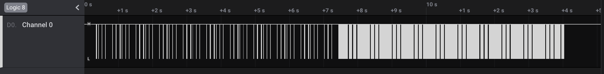
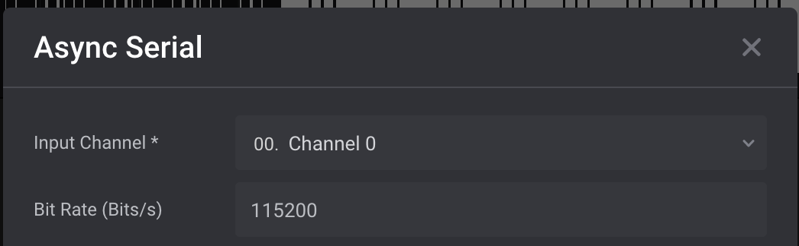
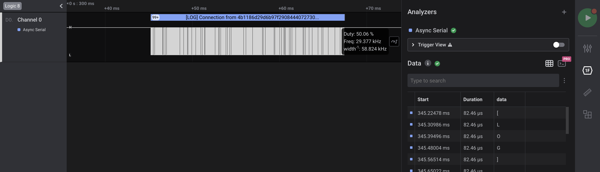
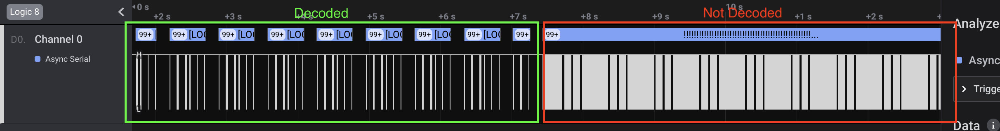
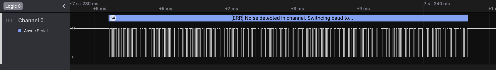
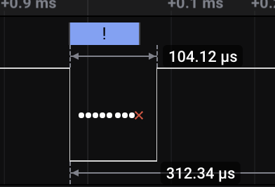
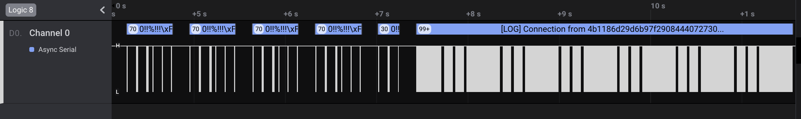
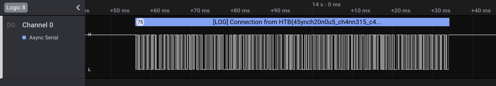

# [__Debugging Interface__](#Debugging Interface)

### Description:
* We managed to gain access to the serial debugging interface of a Raspberry Pi based IoT device, where log messages of the device are being transmitted. However, the default configuration changed during our logic capture and we cant extract all the information.

### Objective:
* Identify that the Raspberry Pi uses the UART protocol on its debugging interface. The default baud rate of 115200 can be used to decode half of the transmission. The second part can be decoded by measuring the time needed for a bit to be transmitted using the Logic building measurement tool, in order to obtain the correct baud rate for the section.

### Difficulty:
* `very easy`

### Flag:
* `HTB{12c_4dd2355_423_c2uc141_70_20u73_d474_70_514v3_d3v1c35_1n_7h3_532141_n37w02k!}`

### Challenge:

We are provided with a .sal logic capture file with one Channel, as we can see once we open it with [Logic](https://www.saleae.com/downloads2/).



If we search for more information on the serial debugging interface of the Raspberry Pi we can see that it is a UART interface with a default baud rate of `115200`, as stated by the [official documentation](https://www.raspberrypi.org/documentation/configuration/uart.md). By adding one of the built-in Logic analyzers and setting the baud rate to the default value, we start observing some Log messages.





Although we get some ASCII message, half of the transmitted data is still not properly decoded. 



The last transmitted message on the default configuration indicates that the baud rate of the transmission changed.



Since the UART protocol is asynchronous, the baud rate describes the number of bits transmitted every second. By analyzing the time it requires for a bit to be transmitted in the new configuration we can conclude the new baud rate.



```
104.12 microseconds = 0.00010412 seconds
1 second/ 0.00010412 second = 9604.302727621975 
```

The value of `9604` can be rounded to `9600`, which appears to be a default baud rate. Next, we can update our analyzer settings we obverse that the second part of the transmission is now decoded.



Finally, we see that the last log message contains the flag:



We can now export the data and create a small script to parse all the messages outputted in the debugging interface.

## Solver

```python
transmited_data = ""
file = open('Untitled2.csv')
data = file.readlines()

for i in range(0,len(data)):
	try:
		data_chr = data[i].split(",")[3].replace("\"","")
	except:
		data_chr = ""
	transmited_data += data_chr

print transmited_data

'''
Output:
...
[LOG] Connection from ab290d3a380f04c2f0db98f42d5b7adea2bd0723fa38e0621fb3d7c1c2808284
[LOG] Connection from a7e6ec5bb39a554e97143d19d3bfa28a9bbef68fa6ecab3b3ef33919547278d4
[LOG] Connection from 099319f700d8d5f287387c81e6f20384c368a9de27f992f71c1de363c597afd4
[LOG] Connection from ab290d3a380f04c2f0db98f42d5b7adea2bd0723fa38e0621fb3d7c1c2808284
[LOG] Connection from HTB{45ynch20n0u5_ch4nn315_c4n_41w4y5_5w4p_f23qu3ncy}
[LOG] Connection from HTB{45ynch20n0u5_ch4nn315_c4n_41w4y5_5w4p_f23qu3ncy}
'''
```

