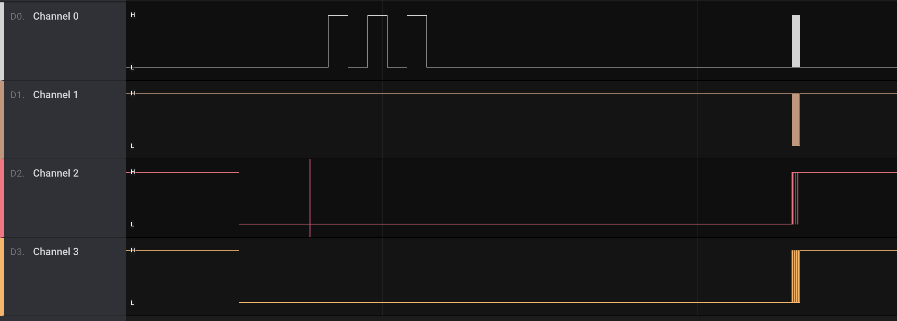
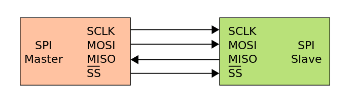
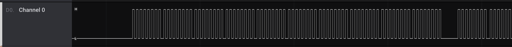
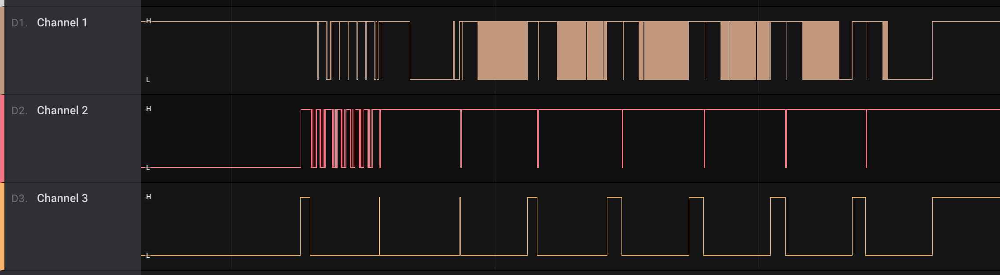
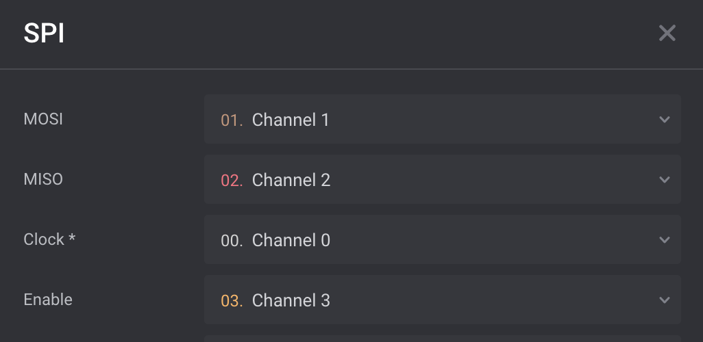
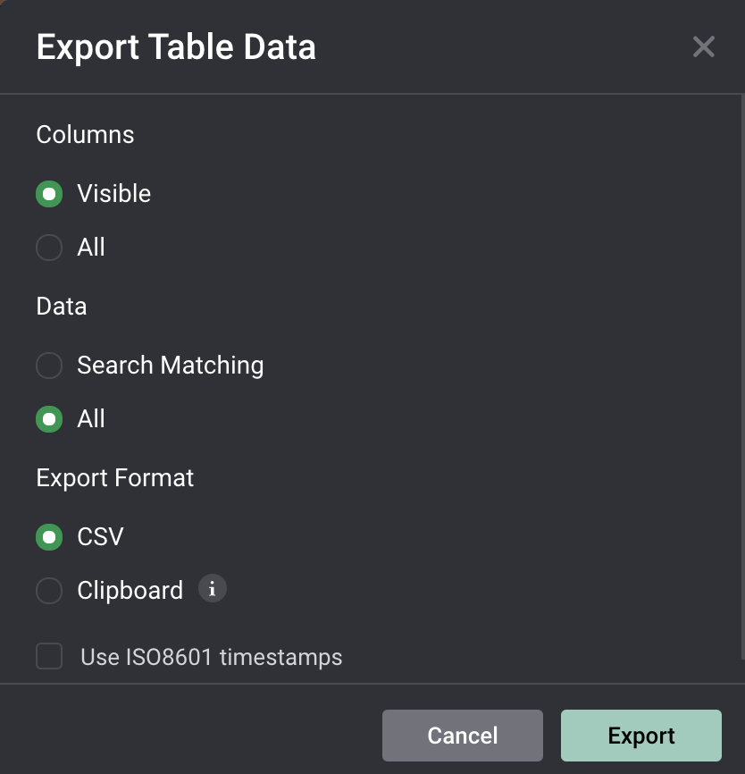

# [__Secret__](#Secret)

### Description:
* We must retrieve the master key stored in a microSD card inside the access control system MCU. The traces connected to the card module are accessible on the top layer of the PCB. This enabled our operative to cut the traces and input a logic capture device in-between them. They could then trigger the read operation of the key that is transmitted over this unprotected serial interface.

### Objective:
* Identify the protocol in use in order to decode the transmitted data, and find what was read by the microSD card.

### Difficulty:
* `very easy`

### Flag:
* `HTB{724c35_c4n_c0mp20m153_4_53cu23d__57023d_m0du13!@#$)}`

### Challenge:

The challenge provides us with a .sal file that we can open with [Logic](https://www.saleae.com/downloads2/). The logic capture consists of 4 channels as we can see in the following image:



We are aware from the description of the challenge that this is a read operation for a MicroSD card, thus we must identify the protocol to decode the transmitted data. Since the channel is unprotected we expect to find the key (flag) in plaintext after we decode the signal. Looking for the [supported interfaces for microSD card](https://en.wikipedia.org/wiki/SD_card#Interface) we can observe that one of them is `SPI` . The [SPI protocol](https://en.wikipedia.org/wiki/Serial_Peripheral_Interface) consists of 4 channels so it appears to be a good candidate.



We can find several resources on how SPI works on SD like the following [pdf](http://www.dejazzer.com/ee379/lecture_notes/lec12_sd_card.pdf). Now we need to identify each of the 4 channels. From the specification of the SPI protocol we can see the use for each channel:

* SCLK: Serial Clock
* MOSI: Master Output → Slave Input 
* MISO: Master Input ← Slave Output 
* SS/CS: Slave Select

Channel 0 appears to have a set of constant interval signals unlike all the other channels, this is the Clock signal.



Now we must identify the CS singal and the remaining two channels will be the data channels MOSI/MISO. Since the decoding proccess for both the data channels is the same we are not intrested in identifying specifically which channel corresponds to input and output. We can observe that `Channel 3` appears to change from high to low before Channels 1 and 2 start having fluctuations. Moreover the CS is by defualt Active Low, thus Channel 3 must be the CS signal.



We can now add the SPI Analyzer and randomly select MOSI and MISO between channels one and two.



We can export the data for further analysis



My searching terms like `master` and `H`, `T`, `B` we can see the plaintext data in chanel 1:


Now we can create a parsing script to obtain the flag.

## Solver

```python
printable = ""
file = open('Untitled.csv')
data = file.readlines()

for i in range(0,len(data)):
	try:
		data_chr = data[i].split(",")[1].replace("\"","")
	except:
		data_chr = ""
	if data_chr.isprintable():
		printable += data_chr


flag_index = printable.find("HTB{")
print(printable[flag_index:flag_index+100])

'''
Output: 
HTB{724c35_c4n_c0mp20m153_4_53cu23d__57023d_m0du13!@#$)}\0\0\0\0\0\0\0\0\0\0\0\0\0\0\0\0\0\0\0\0\0\0
'''
```

