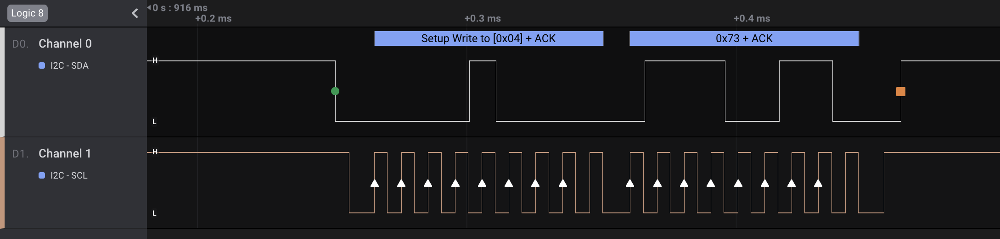

# [__Scrambled__](#Scrambled)

### Description:
* An embedded device in our serial network exploited a misconfiguration in the parsing of the string command null terminator. This changed the settings of some slave devices connected to it, causing a denial of service. We must figure out what was transmitted over the network.

### Objective:
* Identify the protocol in use in order to decode the transmitted data and then find what was transmitted to each address/device.

### Difficulty:
* `very easy`

### Flag:
* `HTB{45ynch20n0u5_ch4nn315_c4n_41w4y5_5w4p_f23qu3ncy}`

### Challenge:

We are provided with a .sal logic capture file with two Channels, as we can see once we open it with [Logic](https://www.saleae.com/downloads2/).


An initial analysis of the channels reveals that Channel 1 is a clock pulse, due to the constant interval. Thus we must find the protocol that uses:

* 2 channels

* 1 CLK  channel

* Have slave and master devices (as hinted by the description)

  

Identifying the protocol is trivial, since the specifications narrow it down to `I2C`, which we can easily determine by comparing the above trace with [common serial communication protocols](https://circuitdigest.com/tutorial/serial-communication-protocols).



We can observe the distinctive characteristic of I2C, which are the two sets of 8-bit values transmitted at each time (address, data). If we add the I2C Analyzer, we can observe that the decoding process works as expected, revealing the transmitted data.


It appears that the device only wrote to two slave devices in the serial network, with addresses of `0x4` and `0x06`.


Since the transmission to each slave device is scrambled, we can export the data for further analysis by creating a python script.


We can export the data as a CSV table from Logic after we change the output of the data to decimal, which makes it easier to parse them.


After exporting the data, we can create a script to separate the data transmitted to each device based on their address, which will reveal the transmitted commands, random data, and the flag.

```
Data transmitted on address 4: set_max_limit_to:10 set_min_limit_to:10 +]<+/~r^yzGbb"#U +JMB BdV SBk 1VQxj`Qyqt% 5md SK\fNh~Q'E-Ls\ t9YNr!n4HyJPvZl\ EpZ b

Data transmitted on address 6: HTB{12c_4dd2355_423_c2uc141_70_20u73_d474_70_514v3_d3v1c35_1n_7h3_532141_n37w02k!}
```

## Solver

```python
i2c_data = {}

file = open('Untitled2.csv')
data = file.readlines()
file.close()

def add_data(address, asc_chr):
	if slave_addr in i2c_data.keys():
		i2c_data[slave_addr] += asc_chr
	else:
		i2c_data[slave_addr] = asc_chr

for i in range(0,len(data)):
	
	slave_addr = data[i].split(",")[2].strip()
	if i+1 <= len(data)-1:
		deci = data[i+1].split(",")[1]

		if len(deci) > 0:
			asc = chr(int(deci))
			if asc.isprintable():
				add_data(slave_addr, asc)
			if asc == "\0":
				add_data(slave_addr, " ")

for address in i2c_data.keys():
	print(address, i2c_data[address])

'''
Output:

4 set_max_limit_to:10 set_min_limit_to:10 +]<+/~r^yzGbb"#U +JMB BdV SBk 1VQxj`Qyqt% 5md SK\fNh~Q'E-Ls\ t9YNr!n4HyJPvZl\ EpZ b
6 HTB{12c_4dd2355_423_c2uc141_70_20u73_d474_70_514v3_d3v1c35_1n_7h3_532141_n37w02k!}
'''
```

