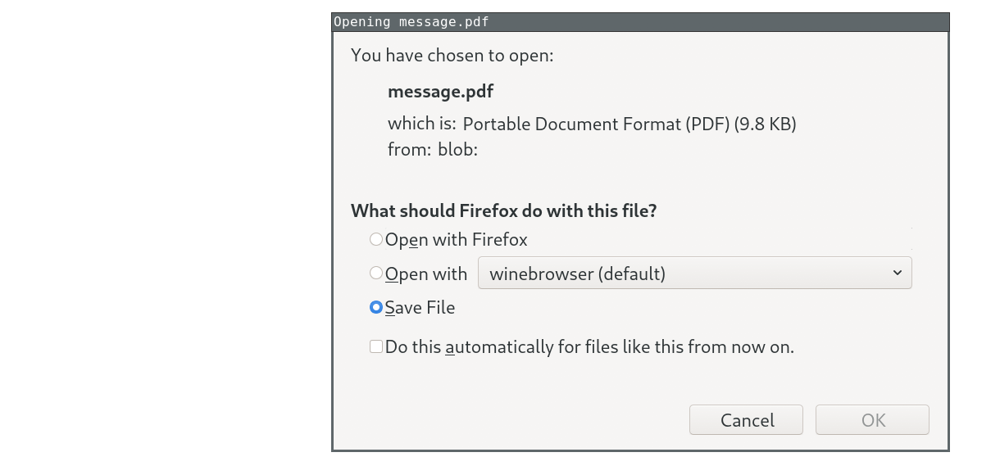
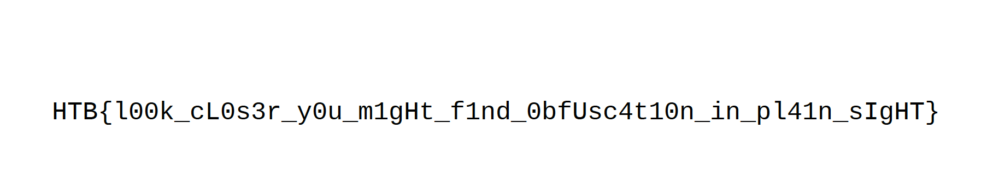

# [__Blobber__](#)

### Description:

* IMF is testing a new way to obfuscate the transmission of top secret documents over the web without using explicit links, in order to avoid detection by web crawlers. Can you confirm transmission is working as expected?

### Objective

* Deobfuscate the JavaScript code, decode the base64-encoded PDF file and read the flag.

### Difficulty:

* `very easy`

### Flag:

* `HTB{l00k_cL0s3r_y0u_m1gHt_f1nd_0bfUsc4t10n_in_pl41n_sIgHT}`

### Release:
* [release/blobber.zip](release/blobber.zip)


# Challenge

We get a file called `message.js` which contains obfuscated JavaScript code:

```javascript
eval(String.fromCharCode(102,117,110,99,116,105,111,110,32,98,97,115,101,54,52,84,111,65,114,114,97,121,66,117,102,102,101,114,40,98,97,115,101,54,52,41,10,123,10,32,32,32,32,118,97<SNIP>))
```

A quick way to deobfuscate the code is to replace the initial call to `eval()` with a `console.log()` statement and run the code through NodeJS.

```bash
sed 's/eval/console.log/' message.js | node
```

The resulting unobfuscated code is shown below.

```javascript
function base64ToArrayBuffer(base64)
{
    var binaryString = window.atob(base64);
    var binaryLen = binaryString.length;
    var bytes = new Uint8Array(binaryLen);
    for (var i = 0; i < binaryLen; i++)
    {
       var ascii = binaryString.charCodeAt(i);
       bytes[i] = ascii;
    }
    return bytes;
}

function ee06904957e1b1e4885656f73c6823f8()
{
    var file = "JVBERi0xLjY<SNIP>";
    var data = base64ToArrayBuffer(file);
    var blob = new Blob([data], {type: "octet/stream"});
    var filename = "message.pdf";
    var a = document.createElement('a');
    document.body.appendChild(a);
    a.style = "display: none";
    var url = window.URL.createObjectURL(blob);
    a.href = url;
    a.download = filename;
    a.click();
    console.log(filename);
    window.URL.revokeObjectURL(url);
}
```

The function named `ee06904957e1b1e4885656f73c6823f8` uses [HTML smuggling](https://secureteam.co.uk/articles/information-assurance/what-is-html-smuggling/) to make clients download a file called `message.pdf` from a Blob object that is built by decoding a base64-encoded string. A similar technique, for example, was employed in the so-called [Duri](https://www.menlosecurity.com/blog/new-attack-alert-duri) campaign to deliver malicious files to target users.

One way to get the `message.pdf` file is by decoding the string using the `base64` program and redirecting its output:

```bash
sed 's/eval/console.log/' message.js | node | grep "var file =" | cut -d'"' -f2 | base64 -d > message.pdf
```

Another way is to create an HTML page that includes the JS file and calls the `ee06904957e1b1e4885656f73c6823f8()` function:

```html
<html>
    <head>
        <script src="message.js"></script>
    <body>
        <script>ee06904957e1b1e4885656f73c6823f8();</script>
    </body>
</html>
```

When opening the page with a web browser that has JavaScript enabled, download of the `message.pdf` file is triggered: 




Either way, the file can be opened with a PDF reader to reveal the flag:


